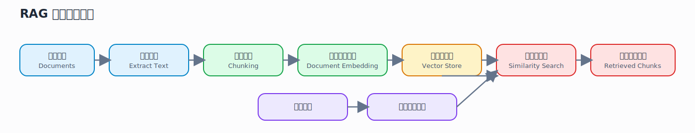
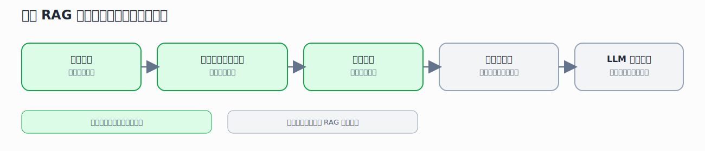
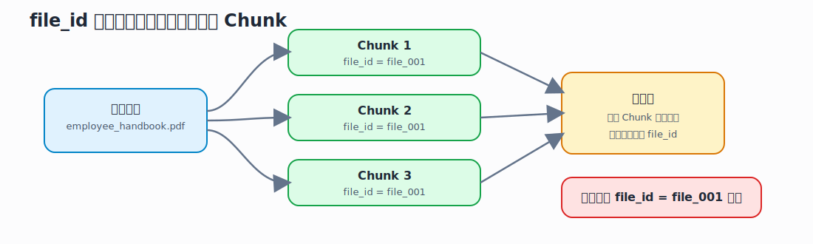
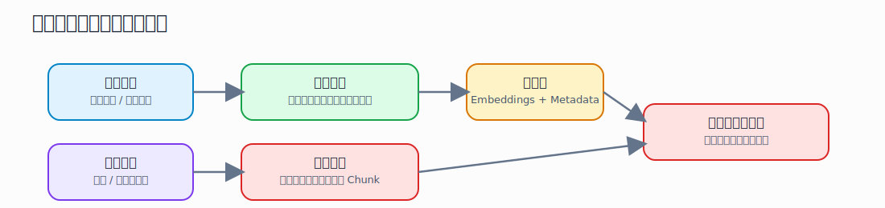
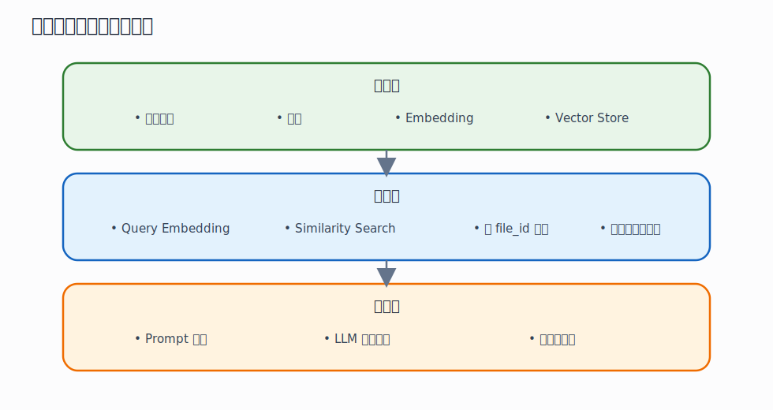

# 第 1 课：RAG 是什么，这个项目到底在做什么

## 1. 本课定位

这是整套课程的起点。

这一课不要求你立刻掌握实现细节，也不要求你马上跑通全部代码。
本课的核心目标只有一个：先建立正确的全局认知。

如果一开始就直接钻进接口、数据库、LangChain 或向量库细节，很容易学成“会跟着改代码，但不知道系统到底在干什么”。
所以第 1 课要先解决三个最根本的问题：

- RAG 到底是什么
- 这个仓库在完整 RAG 系统里扮演什么角色
- 这个仓库“不做什么”

只有这三个问题想清楚了，后面的学习才不会混乱。

## 2. 学习目标

完成本课后，你应该能够：

- 用自己的话解释什么是 RAG
- 说清 RAG 的最小工作流程
- 解释这个仓库为什么是一个“检索服务”而不是“聊天应用”
- 解释 `file_id` 在这个项目中的作用
- 画出这个项目最基础的输入和输出链路

## 3. 前置知识

本课默认你具备以下基础：

- 会一点 Python
- 知道什么是 HTTP 接口
- 知道后端服务的基本概念

如果你还没有接触过这些，也不用停下来。
本课依然可以学，只是读代码时会慢一点。

## 4. 本课要解决的核心问题

在进入源码之前，先把本课的关键问题列出来：

1. 什么是 RAG？
2. RAG 为什么会比“直接问大模型”更适合企业知识库场景？
3. 一个 RAG 系统最少需要哪几个部分？
4. 这个仓库实现了其中哪些部分？
5. 这个仓库没有实现哪些部分？
6. 为什么这个项目要围绕 `file_id` 来组织数据？

整节课都围绕这 6 个问题展开。

## 5. 什么是 RAG

RAG 是 Retrieval-Augmented Generation 的缩写，通常翻译成“检索增强生成”。

它的核心思想很直接：

- 先从外部知识源中检索与问题相关的内容
- 再把检索出来的内容作为上下文交给大模型
- 最后由大模型基于这些上下文生成答案

所以，RAG 不是单纯让大模型“凭记忆回答”。
它是先找资料，再回答。

你可以把它理解成一个两段式过程：

第一段是“找”
- 去文档库、知识库、向量库里找相关内容

第二段是“答”
- 把找到的内容交给模型，让模型做总结、归纳、生成

很多初学者会把 RAG 理解成“把文件丢给模型”。
这个理解不够准确。
严格来说，RAG 是一整条工程链路，不是某一个模型能力。

## 6. RAG 的最小工作流程

一个最小可用的 RAG 系统一般包含这几步：

1. 收集文档
2. 提取文档文本
3. 把长文本切成小块
4. 为每个文本块生成向量
5. 把向量和元数据一起存入向量库
6. 用户提问
7. 把问题也转成向量
8. 在向量库里找最相近的文本块
9. 把这些文本块拼成上下文
10. 交给大模型生成答案

请注意，这 10 步里面，真正“大模型生成答案”只占最后一步。
前面大部分工作其实是数据处理、索引构建和检索工程。

这也是为什么很多 RAG 项目真正的难点，不在 prompt，而在工程设计。

下面这张图可以把“RAG 的最小闭环”先看成一个完整管道：

## 7. 为什么需要 RAG

如果没有 RAG，直接问模型会遇到几个常见问题：

- 模型不知道你的私有知识
- 模型知识可能过时
- 模型回答缺少可追溯依据
- 企业内部资料不可能全部直接塞进 prompt

RAG 的价值就在于：

- 让模型访问私有文档
- 让回答更贴近当前资料
- 让结果可追溯到具体文档
- 让系统更容易持续更新

所以，RAG 本质上是“让模型学会查资料”，而不是“让模型记住一切”。

## 8. 这个仓库在完整 RAG 系统中的位置

现在把视角切回当前仓库。

这个项目的核心工作是：

- 接收文件
- 提取文本
- 切块
- 生成 embedding
- 存入向量库
- 根据查询做相似度检索

也就是说，它主要覆盖的是：

- 索引构建
- 检索服务

它不直接覆盖的是：

- 对话编排
- Prompt 设计
- LLM 最终答案生成
- 多轮上下文管理
- 前端聊天界面

这点非常重要。
如果你把它误以为是“完整 RAG 应用”，你会不断问一些这个仓库本来就不负责解决的问题。

更准确地说，这个仓库像是一个 RAG 系统里的“知识检索后端”。

你可以用下面这张图理解“完整 RAG 系统”和“当前仓库”的关系：

## 9. 先读 README，建立第一层理解

本课第一份必读材料是 [README.md](/rag_api/README.md)。

你读 README 时，不要试图记住所有环境变量。
第一遍只要抓 4 个点：

- 项目的目标是什么
- 它依赖什么技术栈
- 它主要暴露什么能力
- 它特别强调了什么设计思路

在这个仓库里，README 一开头就明确提到：

- 这是一个基于 FastAPI 和 LangChain 的异步可扩展 RAG API
- 支持文档索引与检索
- 默认使用 PostgreSQL/pgvector
- 文档以 `file_id` 为组织核心

其中最关键的一句是“Files are organized into embeddings by `file_id`”。
这句话几乎定义了整个仓库的设计中心。

## 10. 什么叫 ID-based RAG

这个项目最有辨识度的设计，不是“它用了 FastAPI”，也不是“它用了 LangChain”，而是它采用了 ID-based 的思路。

所谓 ID-based，可以理解为：

- 每个文件都有一个 `file_id`
- 这个文件被切出来的所有 chunk 都带着同一个 `file_id`
- 检索时可以按 `file_id` 精确限定范围

这样做的好处是：

- 可以只查某一个文件
- 可以只查一组文件
- 可以做文件级权限控制
- 可以更方便地删除、重建、追踪某个文件的 embedding

这和“把所有文本块简单扔进一个大向量池里”是两种不同思路。

前者更工程化，也更适合业务系统集成。

## 11. 为什么 `file_id` 很重要

你现在可以先把 `file_id` 理解成“文档所属分组标识”。

在这个项目里，它至少承担 4 个角色：

1. 归属标识
把同一个文件拆出来的多个 chunk 归到一起。

2. 检索过滤键
查询时可以指定只在某一个文件或某几个文件中查找。

3. 删除与重建的操作单位
如果某个文件更新了，可以按 `file_id` 删除旧数据，再重新嵌入。

4. 权限与业务集成的锚点
上层系统可以把业务对象和 `file_id` 对应起来。

所以，`file_id` 不是一个普通字段，而是这个仓库的主业务线索。

下面这张图展示了 `file_id` 如何把一个文件拆出来的多个 chunk 重新组织起来：

## 12. 从入口文件理解这个项目的“外壳”

本课第二份必读材料是 [main.py](/Users/rao/Desktop/opensource/rag_api/main.py)。

第 1 课不用深挖全部代码，只需要抓住这几个事实：

- 这是一个 FastAPI 应用
- 应用启动时会初始化资源
- 应用关闭时会清理资源
- 应用会挂载路由
- 应用的主要业务路由来自 `document_routes`

你不需要立刻理解线程池为什么存在，也不需要此时深入数据库初始化。
这里只要知道：

- `main.py` 是应用入口
- 它把整个系统“拼起来”

换句话说，README 让你知道项目“想做什么”，`main.py` 让你知道项目“怎么被组装起来”。

## 13. 这个项目最基础的输入和输出

从系统视角看，这个服务最核心的两类输入只有两种：

第一类输入：文档
- 上传一个文件
- 或指定本地文件

第二类输入：查询
- 输入一个问题或查询字符串

对应地，它最核心的两类输出也是两种：

第一类输出：索引结果
- 文件是否处理成功
- 产生了哪些文档块
- 是否已经入库

第二类输出：检索结果
- 哪些 chunk 与查询最相关
- 这些 chunk 的分数是多少
- 这些 chunk 属于哪个文件

请注意，这里还没有“最终自然语言答案”。
这再次说明，这个仓库不是完整聊天层，而是检索层。

如果只看这个仓库的最基本输入输出，可以把它简化成下面这张图：

## 14. 本项目与完整聊天系统的边界

你可以把完整问答系统想成三层：

第一层：数据层
- 文档解析
- chunk
- embedding
- vector store

第二层：检索层
- query embedding
- similarity search
- filtering
- 返回上下文片段

第三层：生成层
- 组装 prompt
- 调用大模型
- 生成答案
- 返回引用

当前仓库主要覆盖前两层，尤其偏重第一层和第二层。

这三层关系可以直接看成下面这张结构图：

这也是为什么这个仓库很适合用来学习 RAG 底座。
它把最容易被忽视、但最关键的工程部分放到了台前。

## 15. 第 1 课的源码阅读方法

本课不要贪多。
源码阅读顺序建议非常简单：

1. 先读 [README.md](/Users/rao/Desktop/opensource/rag_api/README.md)
2. 再读 [main.py](/Users/rao/Desktop/opensource/rag_api/main.py)
3. 只回答下面 5 个问题，不急着读更多文件

这 5 个问题是：

1. 这个项目的输入是什么？
2. 这个项目的输出是什么？
3. 这个项目的主要职责是什么？
4. 这个项目不负责什么？
5. 为什么 `file_id` 是设计核心？

如果这 5 个问题回答不出来，就不要急着进入后面的代码细节。

## 16. 本课重点术语

你至少要认识下面这些术语：

- RAG
- Retrieval
- Generation
- Embedding
- Chunk
- Metadata
- Vector Store
- `file_id`
- FastAPI
- Route

这一课不要求你非常精确地定义所有术语，但你至少要能说出它们在这个项目中的大致作用。

## 17. 课堂练习

### 练习 1：一句话定义项目

请你用一句话描述这个仓库。

参考方向：
- 它是一个什么服务
- 它处理什么输入
- 它输出什么结果

### 练习 2：画系统框图

画一个最简单的框图，至少包含：

- 文件输入
- 文本提取
- chunk
- embedding
- 向量库
- 查询输入
- 检索结果

### 练习 3：判断边界

判断下列能力是不是当前仓库的核心职责：

- 文件上传
- 文本切块
- 相似度检索
- 最终答案生成
- 多轮对话状态管理
- 按 `file_id` 过滤检索

### 练习 4：解释 `file_id`

不用看后续代码，先用你现在的理解解释：

- 为什么系统需要 `file_id`
- 如果没有 `file_id`，会失去什么能力

## 18. 自查问题

如果你能回答下面这些问题，说明第 1 课已经基本过关：

1. RAG 和“直接问大模型”的核心区别是什么？
2. 为什么说 RAG 的难点不只是 prompt？
3. 这个项目为什么更像“检索后端”而不是“聊天应用”？
4. `file_id` 为什么不是可有可无的字段？
5. 当前仓库的最终输出，为什么通常不是“自然语言答案”？

## 19. 本课总结

这一课最重要的不是技术细节，而是边界感。

你需要先记住三句话：

- RAG 不是一个模型功能，而是一条系统链路。
- 这个仓库主要做的是索引和检索，不是最终生成。
- `file_id` 是这个项目组织数据、控制检索范围、支持业务集成的核心键。

只要这三句话你真正理解了，后面学配置、上传、切块、embedding、向量库和检索接口时，就不会迷路。

## 20. 课后作业

完成以下 3 项作业：

1. 写一段 150 到 300 字的学习笔记，解释这个项目的定位。
2. 手画或电子画一张最小 RAG 流程图。
3. 用你自己的话解释为什么这个仓库强调 `file_id`。

建议把作业保存在你自己的学习笔记里，后面第 5 课和第 11 课还会回头验证你现在的理解是否准确。

## 21. 下一课预告

第 2 课会进入运行层面，主题是：

- 项目怎么启动
- 依赖怎么组织
- Docker 和本地运行分别解决什么问题

第 1 课如果你已经能说清项目定位，第 2 课就会学得很顺。
